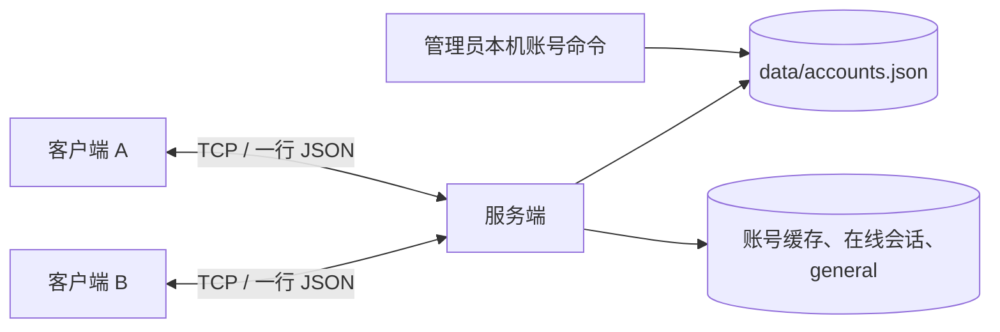

# 开发方案

本文落实[开发需求介绍](DEVELOPMENT_REQUIREMENTS.md)的 R1–R8。项目仍处于代码骨架阶段：`src/` 已按单公共频道整理状态模型和方法边界，但协议、账号、网络与聊天方法仍会显式抛出待实现错误。本机已安装 `cjc`、`cjpm` 1.1.3，并在 Ubuntu 26.04 上通过 TCP 最小探针；现已配置与 SDK 1.1.3 匹配的 stdx 1.1.3.1；`cjpm check` 和 `cjpm build` 均通过。构建有未使用的占位方法与参数警告；服务端、客户端及账号等功能仍为 TODO，运行和联调未验证。

## 1. 架构与数据流



服务端是唯一的身份验证和消息转发节点。客户端之间不直连。服务端启动时读取账号文件，登录后将会话放入在线表并自动加入 `general`；公共消息按在线表分发，私信按目标用户名查在线会话。账号文件持久化，在线状态和消息只在内存中，服务端重启后不保留聊天记录。

| 模块 | 当前骨架 | 实现责任 |
|---|---|---|
| `src/main.cj` | `server/client/account` 模式入口 | 参数校验、模式分派、错误退出 |
| `src/accounts.cj` | `AccountRecord/AccountSummary/AccountStore` 和账号缓存 | 本机账号命令、文件读写、密码派生与验证 |
| `src/protocol.cj` | 消息常量与协议函数签名 | JSON、UTF-8、按行分帧、长度与字段校验 |
| `src/server.cj` | `Session/Server`、在线表与状态锁 | 登录、在线表、公共消息、私信和连接清理 |
| `src/client.cj` | `Client`、服务端地址与收发边界 | 连接、登录、输入命令、后台接收和终端显示 |

计划命令为 `lanchat account add/list/disable/reset`、`lanchat server [port]`、`lanchat client <host> [port]`。账号命令在停服后由管理员运行，`add/reset` 从终端交互获取密码，不把密码放进命令行参数。密码输入方式、密码派生库和安全随机源必须先在 M0 用当前 SDK 验证；账号文件只由账号模块生成和更新，不以手工编辑散列字段代替管理命令。

## 2. 协议约定

TCP 是字节流。每帧为一个 UTF-8 JSON 对象，结尾是 LF；可接收 CRLF。`encode` 只生成 JSON 文本，`writeLine` 追加 LF，每条连接的 `LineReader.read()` 从自己的缓冲区取完整一行，去掉行结束符后交给 `decode`。单帧最大 64 KiB，按 UTF-8 字节数计算且不含 LF；读到超限帧就关闭当前连接。空行忽略，非法 UTF-8、畸形 JSON 和字段错误按协议错误处理。

| 方向 | `type` | 字段 | 服务端行为或客户端显示 |
|---|---|---|---|
| C→S | `login` | `username`, `password` | 验证已发放账号；成功回 `login_ok` |
| C→S | `send_room` | `text` | 向 `general` 全体在线会话发 `message`，含发送者 |
| C→S | `send_private` | `to`, `text` | 只向目标和发送者发 `message`；本人发送仅回一份 |
| C→S | `who` | 无 | 回 `user_list` |
| C→S | `ping` | 无 | 回 `pong`，心跳在最后阶段实施 |
| S→C | `login_ok` | `username`, `room:"general"` | 登录且已进入公共频道 |
| S→C | `message` | `scope`, `from`, `text`, `ts` | 公共消息加 `room:"general"`；私信加 `to` |
| S→C | `user_list` | `room:"general"`, `users` | 在线用户名 |
| S→C | `error` | `code`, `message` | 错误提示 |
| S→C | `system` | `text`, `ts` | 上下线通知 |

登录前仅接受 `login` 和 `ping`。`from`、`scope`、`ts` 必须由服务端根据已验证会话填写；客户端提供这些字段不能改变身份。`send_room` 不要求 `room` 字段，若旧客户端带了此字段，只允许 `general`。用户名限 3–16 位 ASCII 字母、数字、下划线；文本去除首尾空白后需非空，最多 2000 个 Unicode 字符。错误码：`1001` 未登录、`1003` 凭据错误或账号停用、`1005` 私信目标离线、`1006` 协议错误、`1099` 内部错误；未知消息类型返回 `1006`。不将密码或异常堆栈发给客户端。

```json
{"type":"login","username":"alice","password":"课堂测试口令"}
{"type":"login_ok","username":"alice","room":"general"}
{"type":"send_room","text":"大家好"}
{"type":"message","scope":"room","room":"general","from":"alice","text":"大家好","ts":1730000000}
{"type":"send_private","to":"bob","text":"你好"}
{"type":"message","scope":"private","from":"alice","to":"bob","text":"你好","ts":1730000001}
```

示例中的每个对象在实际传输时各占一行。客户端命令只需 `/who`、`/msg <用户名> <内容>`、`/quit`；普通文字发送到公共频道。

## 3. 账号、并发与故障处理

- `data/accounts.json` 保存用户名、启用状态、随机盐、密码派生参数和派生值；不保存明文口令，也不提交 Git。账号命令在停服时操作文件，写入时采用同目录临时文件与原子替换，避免半写文件。加载失败应明确报错并拒绝启动，不能悄悄清空账号。
- 登录成功后每个用户名最多对应一个有效会话。重复登录采用新会话生效、旧会话关闭；清理旧会话前先确认在线表仍指向旧对象，避免误删新登录。
- 一个状态锁保护账号缓存和在线会话。每个会话的写锁防止两条消息交错写入同一 socket。广播时在状态锁下复制目标，释放状态锁后逐个发送；为慢客户端设置写超时或断开策略。
- 客户端主流程读取输入，读线程接收并打印；终端输出加锁。断线或异常进入同一清理路径，单个连接的解析/收发错误不终止服务端进程。
- 密码存储使用经过验证的密码派生库与安全随机盐；M0 先确认所选 SDK 可用实现，再在测试记录中固定库名、版本和参数。当前明文 TCP 不提供链路保密，仅用于可信局域网和课堂测试账号。

## 4. 依赖安装与环境校准（M0）

组员应统一 SDK 与 stdx 版本。本项目的 `cjpm.toml` 使用仓颉 SDK **1.1.3**，相应 stdx 版本为 **1.1.3.1**。从[仓颉官方下载中心](https://cangjie-lang.cn/download/1.1.3)取得与操作系统和 CPU 架构匹配的 SDK；Linux 下载包按 `x64`、`aarch64` 区分，不按 Ubuntu 版本命名。在未列为完整测试平台的系统上，应先编译运行官方 TCP 示例，再继续本项目。

### 加载 SDK 环境

Linux 终端中先执行下面的命令；若 SDK 不在 `~/tools/cangjie`，请改成实际路径：

```bash
source "$HOME/tools/cangjie/envsetup.sh"
cjc -v
cjpm --version
```

`source` 只让**当前终端**获得编译器、包管理器和运行库路径，不会重新安装 SDK。新开终端后需再执行一次；本项目不要求修改全局 shell 配置。

Windows x64 使用 PowerShell 时，将示例目录改为 SDK 的实际解压位置，再在**当前窗口**加载 `envsetup.ps1`：

```powershell
$cjSdkDir = "C:\tools\cangjie"
. "$cjSdkDir\envsetup.ps1"
cjc -v
cjpm --version
```

若使用安装程序而非 ZIP，按安装程序给出的 SDK 位置调整路径。若 PowerShell 执行策略阻止脚本，可按[官方安装指南](https://docs.cangjie-lang.cn/docs/1.0.0/user_manual/source_zh_cn/first_understanding/install_Community.html)处理，或改用 CMD，在当前窗口执行 `call C:\tools\cangjie\envsetup.bat`（路径按实际位置修改），后续 `cjpm` 命令也在同一 CMD 窗口执行。记录 `cjc -v` 输出的 Target，配置依赖时必须与之完全一致。

### 安装 stdx 并连接项目

本项目每条网络消息使用一行 JSON，例如 `{"type":"send_room","text":"你好"}`。源码导入的 `stdx.encoding.json` 是仓颉官方扩展库中的 JSON 包，**需要与 SDK 分开安装**；TCP Socket 使用 `std.net.*`。从[stdx 官方仓库](https://gitcode.com/Cangjie/cangjie_stdx)取得匹配版本。下载后先读解压目录中的 `package.json`，确认 `cjc_version` 为 `1.1.3`，并检查 `dynamic/stdx` 目录中存在 `stdx.encoding.json.cjo` 和对应动态库。

Linux x64 可按官方脚本下载。先阅读脚本，再运行；需要 `curl` 和 `unzip`：

```bash
curl -fsSL https://raw.gitcode.com/Cangjie/cangjie_stdx/raw/main/downloader.sh -o /tmp/lanchat-stdx-downloader.sh
bash /tmp/lanchat-stdx-downloader.sh 1.1.3.1 -p linux-x64 -d ./local-libs
ln -s linux_x86_64_cjnative/dynamic/stdx local-libs/stdx
```

上面的下载脚本会在 `local-libs/` 中解压出 `linux_x86_64_cjnative`，第三行建立 `cjpm.toml` 所需的链接。若已自行解压到其他目录，则在仓库根目录用以下方式建立链接。把下面的 `CJ_STDX_DIR` 改为**实际包含 `dynamic` 目录的路径**；若 `local-libs/stdx` 已存在，先检查它的目标，不要重复创建：

```bash
CJ_STDX_DIR="$HOME/tools/cangjie-stdx-linux-x64-1.1.3.1/linux_x86_64_cjnative"
mkdir -p local-libs
ln -s "$CJ_STDX_DIR/dynamic/stdx" local-libs/stdx
```

`cjpm.toml` 的 Linux `path-option` 指向 `./local-libs/stdx`，该目录被 Git 忽略。其他 Linux 组员需按各自路径创建同名目录或链接。

Windows x64 在**仓库根目录的 PowerShell** 中下载匹配的 stdx。先阅读[官方 stdx 下载说明](https://github.com/cangjielanguage/cangjie_stdx/blob/main/README.md)和脚本，再运行：

```powershell
New-Item -ItemType Directory -Force .\local-libs | Out-Null
Invoke-WebRequest https://raw.gitcode.com/Cangjie/cangjie_stdx/raw/main/downloader.ps1 -OutFile "$env:TEMP\lanchat-stdx-downloader.ps1"
& "$env:TEMP\lanchat-stdx-downloader.ps1" 1.1.3.1 -p windows-x64 -d .\local-libs
Get-Content .\local-libs\windows_x86_64_cjnative\package.json
Test-Path .\local-libs\windows_x86_64_cjnative\dynamic\stdx\stdx.encoding.json.cjo
```

若执行策略阻止下载脚本，可从官方 stdx 发布页手动下载 `cangjie-stdx-windows-x64-1.1.3.1.zip`。将下例路径改为 ZIP 的实际位置，再解压到仓库的 `local-libs/`，最后运行上面的 `Get-Content` 与 `Test-Path` 检查：

```powershell
$stdxZip = "$env:USERPROFILE\Downloads\cangjie-stdx-windows-x64-1.1.3.1.zip"
Expand-Archive -Path $stdxZip -DestinationPath .\local-libs -Force
```
`package.json` 的 `cjc_version` 应为 `1.1.3`，`Test-Path` 应输出 `True`。`cjpm.toml` 已为官方示例 Target `x86_64-w64-mingw32` 配置 `./local-libs/windows_x86_64_cjnative/dynamic/stdx`；若 `cjc -v` 显示其他 Target，按实际值修改表名。路径格式参见[官方 cjpm 文档](https://docs.cangjie-lang.cn/docs/1.0.5/tools/source_zh_cn/cmd-tools/cjpm_manual.html)。直接运行将来编译出的程序时，若 Windows 提示找不到 stdx DLL，可在**当前 PowerShell 窗口**执行以下命令，再启动程序；这不会修改全局环境变量：

```powershell
$stdxBinDir = (Resolve-Path .\local-libs\windows_x86_64_cjnative\dynamic\stdx).Path
$env:Path = "$stdxBinDir;$env:Path"
```

依赖就绪后，在仓库根目录运行；Linux 在已加载 SDK 的终端、Windows 在已加载 SDK 的 PowerShell 窗口执行：

```text
cjpm check
cjpm build
```

构建通过仅表明框架可编译。JSON 编解码、账号、登录和聊天仍需按[各阶段验收方案](STAGE_ACCEPTANCE.md)实现和验证。

### 环境配置注意事项

| 情况 | 处理方法 |
|---|---|
| `cjc` 或 `cjpm` 提示找不到命令 | Linux 在当前终端加载 `envsetup.sh`；Windows PowerShell 在当前窗口加载 `envsetup.ps1`。再用 `cjc -v`、`cjpm --version` 检查；新窗口需重新加载。 |
| `cjpm check` 提示找不到 `stdx.encoding.json` | 检查 stdx 是否单独安装、`cjpm.toml` 的 Target 是否与 `cjc -v` 一致，以及对应平台的 `path-option` 是否指向真实的 `dynamic/stdx`。 |
| stdx 已下载，但仍无法编译 | 比较 `cjc -v` 与 stdx `package.json` 中的 `cjc_version`。例如 stdx 1.2.0.1 要求 cjc 1.2.0，不能配 SDK 1.1.3；本项目应使用 stdx 1.1.3.1。 |
| 下载出现 `curl: (23) client returned ERROR on write` | [curl 官方说明](https://curl.se/libcurl/c/libcurl-errors.html)将错误 23 归为写入失败；单凭这条信息不能判定具体原因。检查目标目录可写、剩余空间及输出管道；若已有 ZIP，运行 `unzip -tq path/to/archive.zip`，校验失败再重新下载。压缩包完整也不表示版本匹配。 |
| `cjpm build` 出现大量未使用警告 | 先确认命令最终是否成功。框架中的 TODO 方法和参数会产生警告；编译通过不等于聊天功能已完成，阶段验收仍须按对应测试执行。 |

## 5. 开发规程、顺序与风险

按[各阶段验收方案](STAGE_ACCEPTANCE.md)的 M0→M4 推进。每个功能遵循“更新协议 → 实现服务端 → 实现客户端 → 写测试 → 两终端联调”的顺序。建议一人负责协议与依赖、一人负责账号和服务端、一人负责客户端、一人负责测试；人数不足时合并职责。合并前检查身份来源、输入校验、持锁范围、断线清理、协议和文档是否一致。每周保留一次可编译演示，不能因存在 TODO 就声称已通过阶段验收。

分支、提交、同步和 Pull Request 的具体操作见[Git 与 GitHub 协作指南](../CONTRIBUTING.md)。

| 风险 | 处理方式 |
|---|---|
| SDK/API 与骨架不一致 | M0 先跑官方 TCP/JSON 探针，确定包名和函数签名 |
| TCP 粘包、半包或 UTF-8 截断 | 按字节累积至 LF 后再解码，并按字节检查帧上限 |
| 重复登录与断线竞态 | 状态锁维护在线表，清理前比对会话对象 |
| 慢客户端拖住广播 | 不持状态锁写 socket，设置写超时 |
| 校园网无法互访 | 先测 localhost，再测双机 IP；检查防火墙、端口和 WiFi 客户端隔离 |
| 账号文件损坏或泄露 | 原子替换、权限限制和备份；不提交运行数据 |

## 6. 文件与图片扩展

核心验收后再设计分块传输：服务端按目标会话转发文件请求与分块，接收方可拒绝；限制文件大小，记录块序号和最终摘要，清理路径分隔符并禁止覆盖现有文件。图片走同一文件通道。扩展不影响 R1–R8 的完成判定；其单独验收见[各阶段验收方案](STAGE_ACCEPTANCE.md)。
